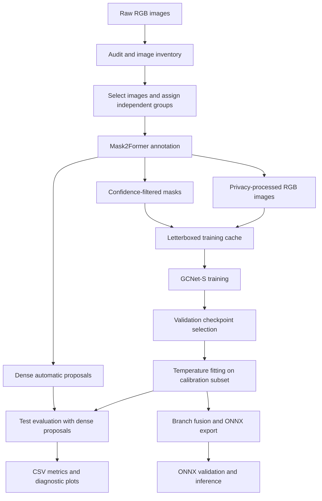

# Automatic-Image-Dataset-Preprocessing-Annotation-and-Label-Generation
An end-to-end pipeline for preprocessing raw image datasets, privacy protection, automatic semantic annotation, mask generation, dataset partitioning, and validation for semantic segmentation.


# Semantic segmentation of street images for delivery robots

A PyTorch implementation for auditing raw images, generating automatic semantic masks, preparing a training dataset, training GCNet-S, evaluating segmentation and calibration, and exporting a verified ONNX model.

We developed this implementation for the RobustSAR project, supported by Portugal's Foundation for Science and Technology. The original data consist of images extracted from bicycle-mounted stereo recordings collected in Lisbon. The code processes individual RGB images. It does not require stereo input and does not perform video decoding, stereo rectification, depth estimation, robot control, or route planning.

**The included experiment uses automatically generated reference masks. Its scores measure agreement with those masks, not independently established accuracy against human annotations.**

**To use another dataset, adapt the input organisation and split policy before running annotation or training.** The current scripts contain fixed Lisbon experiment settings. They are suitable starting points for other urban RGB datasets, but they do not automatically provide meaningful labels for every image domain. Medical images, satellite imagery, indoor scenes, and other domains require a suitable annotation model and class policy.

## Contents

- [Pipeline overview](#pipeline-overview)
- [Repository structure](#repository-structure)
- [Environment and installation](#environment-and-installation)
- [Download the annotation model](#download-the-annotation-model)
- [Choose the correct workflow](#choose-the-correct-workflow)
- [Prepare another raw image dataset](#prepare-another-raw-image-dataset)
- [Define semantic classes](#define-semantic-classes)
- [Generate automatic masks](#generate-automatic-masks)
- [Prepare caches and review labels](#prepare-caches-and-review-labels)
- [Train the segmentation model](#train-the-segmentation-model)
- [Calibrate and evaluate](#calibrate-and-evaluate)
- [Understand the metrics](#understand-the-metrics)
- [Use the exported model](#use-the-exported-model)
- [File formats and output artifacts](#file-formats-and-output-artifacts)
- [Adapt the implementation](#adapt-the-implementation)
- [Troubleshooting](#troubleshooting)
- [Recorded Lisbon experiment](#recorded-lisbon-experiment)
- [Prepare a GitHub repository](#prepare-a-github-repository)
- [Reproducibility and attribution](#reproducibility-and-attribution)

## Pipeline overview

The annotation model and the model intended for deployment serve different purposes.

| Component | Implementation | Purpose |
| --- | --- | --- |
| Annotation teacher | Mask2Former with a Swin-L backbone and Mapillary Vistas weights | Generate offline urban-scene labels |
| Student model | GCNet-S with three-class segmentation heads | Learn from the prepared dataset |
| Deployment model | GCNet-S with fused convolution branches and no auxiliary head | Run segmentation through ONNX or PyTorch |

The teacher assigns fine-grained categories to pixels. The annotation script maps these categories to path, obstacle, and background. It saves both confidence-filtered training masks and dense automatic proposals. Training and temperature fitting use the filtered masks. The primary test evaluation uses dense proposals to retain semantic boundaries.



All image processing runs locally. The supplied scripts do not send images to an external annotation service. Downloading the teacher requires network access. After its files are available locally, annotation loads them with `local_files_only=True`.

## Repository structure

Run commands from the directory containing this README, `scripts/`, and `src/`. The name of that directory is not significant.

```text
your-project/
├── README.md
├── requirements-observed.txt
├── src/
│   ├── gc_backbone.py
│   ├── gc_compat.py
│   ├── model.py
│   ├── data.py
│   └── metrics.py
├── scripts/
│   ├── audit.py
│   ├── annotate.py
│   ├── prepare.py
│   ├── dataset_plots.py
│   ├── train.py
│   ├── evaluate.py
│   ├── infer_onnx.py
│   ├── test_metrics.py
│   └── summarise.py
├── checkpoints/teacher/       # Downloaded annotation model
├── data/                      # Generated dataset and manifests
├── reports/                   # Dataset reports and logs
├── runs/gcnet_s/               # Training, evaluation, and export
├── thesis/                    # Optional Lisbon experiment note
└── vendor/GCNet/               # Upstream source snapshot and licences
```

The core runtime imports the local files in `src/`. It does not require an installation of MMCV, MMEngine, or MMSegmentation. The vendor snapshot records the source from which the backbone was adapted.

The generated dataset, teacher weights, trained checkpoints, and original photographs are not required in a source-only GitHub repository. Readers generate these outputs or obtain a separately distributed model.

## Environment and installation

### Software

The recorded experiment used Linux, Python 3.9.25, PyTorch 2.8.0 with a CUDA 12.8 build, and the versions in [requirements-observed.txt](requirements-observed.txt).

That file records observed package versions. It is **not a complete environment lock** and does not specify the NVIDIA driver, CUDA wheel index, every transitive dependency, or all platform constraints. For a new installation, use an isolated environment with a Python version supported by those packages. The example below uses Python 3.11.

```bash
python3.11 -m venv .venv
source .venv/bin/activate
python -m pip install --upgrade pip
```

For an NVIDIA workstation compatible with the CUDA 12.8 wheels, install the matching PyTorch and torchvision versions first.

```bash
python -m pip install torch==2.8.0 torchvision==0.23.0 \
  --index-url https://download.pytorch.org/whl/cu128
python -m pip install -r requirements-observed.txt
python -m pip check
```

Select a wheel build appropriate for the machine using the [official PyTorch installation instructions for previous versions](https://pytorch.org/get-started/previous-versions/#v280). The example is a workstation setup, not a Jetson Nano installation procedure.

Check the environment before downloading images or launching a long run.

```bash
python - <<'PY'
import torch
import torchvision
import transformers
import cv2
import numpy
import scipy
import onnx
import onnxruntime

print("PyTorch", torch.__version__)
print("CUDA build", torch.version.cuda)
print("CUDA available", torch.cuda.is_available())
print("GPU count", torch.cuda.device_count())
for index in range(torch.cuda.device_count()):
    print(index, torch.cuda.get_device_name(index))
print("ONNX Runtime", onnxruntime.__version__)
PY
```

A fresh environment should pass the metric checks.

```bash
python scripts/test_metrics.py
```

### Hardware

Annotation, training, and the evaluation driver currently use CUDA. Audit, cache preparation, plots, metric checks, and the supplied ONNX inference command can run on a CPU.

The original student training used an NVIDIA L40S. Annotation used several server GPUs with independent image shards. These devices describe the measured experiment, not minimum hardware requirements.

Memory requirements depend on native image resolution, teacher inference resolution, and batch size. Start annotation with one or two images per batch. The teacher restores 65 score maps to native resolution, so very large source images can consume substantial memory even when `--long-edge` is small.

Training uses a `384 × 640` canvas. Use a batch size of at least two because the training architecture contains batch normalisation after global pooling. The training subset must contain at least one complete batch.

Store the raw images outside the repository. Leave space for processed RGB images, masks, confidence maps, overlays, caches, and checkpoints. For context, the Lisbon run produced approximately 4.7 GiB of processed images and 1.4 GiB of training caches for 4,574 selected frames. Storage requirements vary with image content and resolution.

### CPU inference only

The exported ONNX graph can run independently of PyTorch in an application that implements preprocessing and output restoration. However, **the supplied `infer_onnx.py` script imports `src.data`, which imports PyTorch**.

For this script, a CPU-only installation still needs PyTorch, NumPy, Pillow, OpenCV, and ONNX Runtime. A minimal example is

```bash
python -m pip install torch==2.8.0 \
  --index-url https://download.pytorch.org/whl/cpu
python -m pip install numpy==1.26.4 Pillow==11.3.0 \
  opencv-python==4.7.0.72 onnxruntime==1.19.2
```

Use either the CPU inference environment or the CUDA workflow environment as appropriate.

## Download the annotation model

The annotation script expects these exact local filenames.

```text
checkpoints/teacher/config.json
checkpoints/teacher/preprocessor_config.json
checkpoints/teacher/model.safetensors
```

The default checkpoint is [facebook/mask2former-swin-large-mapillary-vistas-semantic](https://huggingface.co/facebook/mask2former-swin-large-mapillary-vistas-semantic).

The following example resolves the repository to a commit, downloads only the required files, and records the commit and file hashes. Run it in a fresh project with no existing teacher files.

```bash
mkdir -p data reports runs checkpoints/teacher

python - <<'PY'
import hashlib
import json
from pathlib import Path
from huggingface_hub import HfApi, snapshot_download

repo_id = "facebook/mask2former-swin-large-mapillary-vistas-semantic"
target = Path("checkpoints/teacher")
names = ["config.json", "preprocessor_config.json", "model.safetensors"]

if any((target / name).exists() for name in names):
    raise FileExistsError("Teacher files already exist. Verify and reuse them.")

revision = HfApi().model_info(repo_id).sha
snapshot_download(
    repo_id=repo_id,
    revision=revision,
    local_dir=str(target),
    allow_patterns=names,
)
hashes = {}
for name in names:
    path = target / name
    if not path.is_file():
        raise FileNotFoundError(path)
    hashes[name] = hashlib.sha256(path.read_bytes()).hexdigest()

record = {"repo_id": repo_id, "revision": revision, "sha256": hashes}
Path("reports/teacher_download.json").write_text(json.dumps(record, indent=2))
print(json.dumps(record, indent=2))
PY
```

The [Hugging Face download guide](https://huggingface.co/docs/huggingface_hub/guides/download) explains revision selection and local downloads. Pin and retain the recorded revision for subsequent runs. Resolving the current repository commit does not establish that its files match the historical Lisbon experiment. Compare content hashes when reproducing that experiment.

The current loader assumes one `model.safetensors` file. A differently packaged or sharded checkpoint requires changes to the loading and fingerprinting code.

## Choose the correct workflow

### Reproduce the recorded Lisbon configuration

The following sequence applies to a fresh project copy using the original compatible filename sequence and the recorded split policy. It does not preserve an existing run in the same output directories.

```bash
mkdir -p data reports runs

python scripts/audit.py --source ../combined_images --out data --stride 15
python scripts/annotate.py --device cuda:0 --batch-size 2 --long-edge 1024
python scripts/prepare.py
python scripts/dataset_plots.py
python scripts/test_metrics.py
python scripts/train.py --device cuda:0 --epochs 60 --batch-size 12
python scripts/evaluate.py --device cuda:0 --reference dense
```

The teacher must already be downloaded. Inspect the selected split counts and generated masks before training.

### Use another dataset

Follow [Prepare another raw image dataset](#prepare-another-raw-image-dataset) before the annotation command. In particular, supply suitable split membership and adapt the calibration-partition block in `prepare.py`.

Use a **separate project directory for each dataset or experiment**. Preparation, training, evaluation, and reporting locate data relative to their own script files. They do not accept a common `--dataset-root` or `--run-dir` argument. The annotator's `--root` option alone does not redirect the other scripts.

A useful layout is

```text
experiments/
├── dataset_a/                 # Its own src, scripts, data, reports, and runs
├── dataset_b/                 # A separate project copy
└── raw_data/                  # Preserved source images
```

Copy source files and licences into a new project. Start its `data/`, `reports/`, and `runs/` directories without artifacts from an earlier dataset. A copied `label_policy.json` or checkpoint can otherwise refer to a different experiment.

## Prepare another raw image dataset

### Input contract

The current audit script has the following requirements.

| Property | Current requirement |
| --- | --- |
| File discovery | Lowercase `*.png` files directly inside one folder |
| Recursive directories | Not supported by the audit command |
| Filename suffix | An integer after the final underscore, such as `image_000001.png` |
| Image identifier | Filename stem, unique across the whole dataset |
| Ordering | Lexicographic filename order and numeric suffix |
| Straightforward image modes | RGB or fully opaque RGBA |
| Video input | Extract frames before running the scripts |
| Raw data mutation | The pipeline reads source files and writes separate derivatives |

Use globally unique, zero-padded names, ideally starting at one. Names such as `frame_left.png` cause integer parsing to fail. Reusing `image_000001.png` for multiple recordings loses identity when files are placed in one directory.

The scripts convert images to RGB but do not perform camera calibration, lens correction, photometric calibration, colour-profile normalisation, or EXIF-based orientation correction. Apply and record any required transformations before auditing.

For transparent images, define an explicit validity or compositing policy. The current annotator masks transparency only for RGBA training labels, and **dense proposals do not apply that alpha exclusion**. Use opaque RGB input for the workflow described here.

### Optional conversion and filename standardisation

The following example converts ordinary single-frame RGB photographs from common formats to an opaque PNG working copy. It preserves the source files and writes a filename mapping.

Replace the source path. Use a new destination directory. This example intentionally rejects transparency, high-bit-depth modes, and multiframe files because those inputs require an explicit conversion policy.

```python
from pathlib import Path
from PIL import Image, ImageOps
import csv

source = Path("/absolute/path/to/original_images").resolve()
destination = Path("../raw_frames").resolve()
extensions = {".jpg", ".jpeg", ".png", ".bmp", ".webp", ".tif", ".tiff"}
files = sorted(
    path for path in source.rglob("*")
    if path.is_file() and path.suffix.lower() in extensions
)
if not files:
    raise ValueError("No supported image files were found.")
destination.mkdir(parents=True, exist_ok=False)

with (destination / "filename_mapping.csv").open("w", newline="") as handle:
    writer = csv.DictWriter(handle, ["image_id", "original_path", "working_path"])
    writer.writeheader()
    for index, path in enumerate(files, start=1):
        with Image.open(path) as original:
            if getattr(original, "n_frames", 1) != 1:
                raise ValueError(f"Multiframe input needs a policy: {path}")
            if original.mode not in {"RGB", "RGBA", "L", "LA", "P"}:
                raise ValueError(f"Unsupported image mode {original.mode}: {path}")
            image = ImageOps.exif_transpose(original).convert("RGBA")
            if image.getchannel("A").getextrema()[0] != 255:
                raise ValueError(f"Transparent input needs a policy: {path}")
            image_id = f"image_{index:08d}"
            output = destination / f"{image_id}.png"
            image.convert("RGB").save(output)
        writer.writerow({
            "image_id": image_id,
            "original_path": str(path),
            "working_path": str(output),
        })
```

Lexicographic conversion order is reproducible but does not establish chronology. For recordings, construct the ordering from known capture metadata and retain recording, route, camera, and timestamp information in a separate acquisition manifest. Place both stereo views and related recording segments in the same independent split group.

### Audit the working images

```bash
python scripts/audit.py --source ../raw_frames --out data --stride 1
```

The audit writes `inventory.csv`, `selected.csv`, and `audit.json`. It records decoding status, dimensions, SHA-256, exposure indicators, thumbnail sharpness, and a 64-bit difference hash.

Exact duplicates mean identical file bytes. Two encodings of the same scene can have different SHA-256 values. The later perceptual-hash check addresses some visual similarity, but it does not prove scene independence.

The `saturation_fraction` field measures the fraction of bright grayscale pixels above 245. It does not measure colour saturation. Sharpness uses Laplacian variance on a `160 × 90` thumbnail, so it is a relative audit indicator rather than a universal quality threshold.

### Understand the default sampling and split assumptions

The unmodified audit selects frame indices satisfying

```python
(frame_index - 1) % stride == 0
```

It calculates nominal sampling FPS as `30 / stride`, regardless of the actual acquisition rate. Therefore, `--stride 15` means nominally 2 FPS only for a 30 FPS source sequence with the assumed indexing.

The default split calculations use

| Setting | Implementation |
| --- | --- |
| Training boundary | 70% of the maximum filename frame index |
| Validation boundary | 85% of that maximum |
| Temporal guards | Exclude indices within 300 of either boundary |
| Proxy group | Each block of 900 filename-indexed frames |
| Calibration | Reserve a portion of validation, with a further 150-index guard |

These are index calculations, not exact percentages of retained images. Gaps in indexing, duplicate removal, guards, and sampling change the final counts.

For another dataset, these constants can empty a subset or produce overlap between proxy groups. **Changing only `--stride` is not a sufficient split adaptation.** Do not remove the group-overlap assertion simply to make preparation continue.

### Supply explicit recording or route splits

For a new study, assign complete recordings or routes to the training, validation, calibration, and test subsets. Choose groups that correspond to the intended generalisation claim. A geographic evaluation may require grouping repeated visits to the same route together.

Create `data/split_assignments.csv` using the working image identifiers. This small example illustrates the schema, not an adequate training dataset.

```csv
image_id,group_id,split
image_00000001,recording_A,train
image_00000002,recording_A,train
image_00000101,recording_B,val
image_00000201,recording_C,calibration
image_00000301,recording_D,test
```

List only the images selected for the experiment. Temporal subsampling should occur within recordings before writing these assignments. Include varied surfaces, illumination, camera poses, and obstacle types in a way that respects group separation. Keep a separate test set for final evaluation.

After auditing, run this example from the project root to replace the default `data/selected.csv` with the explicit assignments. Run it **before annotation**.

```python
import csv
from collections import Counter
from pathlib import Path

data = Path("data")
inventory = list(csv.DictReader((data / "inventory.csv").open()))
assignments = list(csv.DictReader((data / "split_assignments.csv").open()))
by_id = {row["image_id"]: row for row in inventory}
allowed = {"train", "val", "calibration", "test"}

if len(by_id) != len(inventory):
    raise ValueError("Image identifiers are not globally unique.")
if not assignments:
    raise ValueError("The split assignment file is empty.")

selected = []
seen = set()
group_split = {}
for assignment in assignments:
    image_id = assignment["image_id"]
    group_id = assignment["group_id"]
    split = assignment["split"]
    if image_id in seen:
        raise ValueError(f"Duplicate assignment for {image_id}")
    if not group_id or split not in allowed:
        raise ValueError(f"Invalid group or split for {image_id}")
    if image_id not in by_id or by_id[image_id]["status"] != "valid":
        raise ValueError(f"Missing, unreadable, or duplicate image {image_id}")
    if group_id in group_split and group_split[group_id] != split:
        raise ValueError(f"Group spans multiple splits: {group_id}")
    group_split[group_id] = split
    seen.add(image_id)
    selected.append({
        **by_id[image_id],
        "selected": True,
        "group_id": group_id,
        "split": split,
    })

counts = Counter(row["split"] for row in selected)
if set(counts) != allowed:
    raise ValueError(f"Every subset must be nonempty. Found {dict(counts)}")
selected.sort(key=lambda row: (int(row["frame_index"]), row["image_id"]))
with (data / "selected.csv").open("w", newline="") as handle:
    writer = csv.DictWriter(handle, list(selected[0]))
    writer.writeheader()
    writer.writerows(selected)
print(dict(counts))
```

This changes the selection file, not the historical default-selection summary in `data/audit.json`. Record the custom sampling method and counts separately, and update report text before publication.

**One source edit is required for this custom-split workflow.** In your new project copy, open [scripts/prepare.py](scripts/prepare.py). Replace the block beginning with `# Reserve a contiguous part of validation` and ending immediately before `# dHash similarity is a review signal` with the following indented block. It sits inside `main()`, so retain its four-space indentation.

```python
    # Explicit assignments already include a separate calibration subset.
    boundary = None
```

In the same file, set the recorded `calibration_guard_frames_each_side` value to `0` unless you have explicitly applied a different guard. Update the `split_independence` description to explain the supplied groups. The resulting `calibration_boundary_index` is `null` because one numeric boundary no longer describes the partition.

Keep the similarity check and group-disjointness assertion. They remain useful with actual recording identifiers.

The evaluation script currently records `route_independence_verified=False`, and the plot titles refer to a provisional chronological split. Update these descriptions only when the acquisition metadata and split audit support the revised claims. Group assignment alone is not evidence that recordings cover different locations.

Continue with class-policy review, teacher annotation, cache preparation, and training.

## Define semantic classes

### Default taxonomy

| Pixel ID | Class | Definition |
| --- | --- | --- |
| `0` | path | Roads, bicycle lanes, sidewalks, pedestrian areas, crossings, parking and service lanes, curb cuts, road markings, catch basins, and manholes |
| `1` | obstacle | People, riders, animals, vehicles, kerbs, walls, buildings, barriers, signs, poles, street furniture, rail tracks, potholes, and the remaining mapped obstruction categories |
| `2` | background | Sky, water, vegetation, natural terrain, sand, snow, mountains, bridge and tunnel structures, and banners |
| `255` | ignore | Pixels excluded from the relevant reference or training domain |

The path class includes carriageways. This semantic label does not establish legal robot access, surface stability, sufficient width, clearance, or collision-free motion. Background is not equivalent to free space.

Ignore has different uses at different stages.

| Artifact | Ignored pixels |
| --- | --- |
| `data/masks/` | Low teacher confidence, teacher ego/car-mount categories, and transparent RGBA source pixels |
| `data/dense_proposals/` | Teacher ego/car-mount categories |
| Training cache masks | The filtered-mask exclusions plus letterbox and augmentation padding |
| Model predictions | No ignore output channel |

### Teacher mapping

The default teacher predicts 65 categories. [scripts/annotate.py](scripts/annotate.py) contains these index lists.

```python
PATH_IDS = [7, 8, 9, 10, 11, 13, 14, 15, 23, 24, 36, 41]
BACKGROUND_IDS = [16, 18, 25, 26, 27, 28, 29, 30, 31, 32]
IGNORE_IDS = [63, 64]
```

All remaining categories map to obstacle. `data/label_policy.json` records the complete mapping together with the teacher's category names.

Inspect the teacher configuration before changing the mapping. Numeric category IDs are specific to the checkpoint. A new checkpoint with a different category order cannot reuse these lists without verification.

The implementation hardcodes three output classes in several modules. A different taxonomy requires the coordinated changes described in [Adapt the implementation](#adapt-the-implementation).

## Generate automatic masks

### Pilot annotation

Start with a small annotation run to inspect geometry, class mapping, privacy processing, and GPU memory use.

```bash
python scripts/annotate.py \
  --device cuda:0 \
  --batch-size 1 \
  --long-edge 1024 \
  --limit 12
```

Inspect `data/overlays/` and the corresponding single-channel masks. A pilot does not shorten `selected.csv`. Complete the remaining selected images before running preparation.

If the class policy or inference resolution needs to change, use a new annotation-version directory or new project copy. Do not bypass the policy checks by deleting provenance files from a partially labelled dataset.

### Full annotation

```bash
python scripts/annotate.py \
  --device cuda:0 \
  --batch-size 2 \
  --long-edge 1024
```

The default batch size in the script is four. The examples use smaller batches to make the initial memory requirement easier to assess.

### Annotation operations

For each selected image, the script

1. Verifies the source bytes against the audit SHA-256 when annotation is required.
2. Resizes a working copy to a maximum edge of 1,024 pixels by default, preserving aspect ratio.
3. Runs the Mapillary teacher in CUDA mixed precision.
4. Applies softmax to query class logits and sigmoid to query mask logits.
5. Interpolates mask probabilities, removes processor padding, combines query scores, and restores semantic maps to native resolution.
6. Aggregates fine-grained categories into the three target classes.
7. Produces the dense proposal and confidence-filtered training mask.
8. Blurs predicted privacy-sensitive regions in an RGB derivative.
9. Writes outputs and finally commits per-image metadata.

This implementation applies sigmoid **before** interpolation of query masks. The installed upstream Hugging Face postprocessor interpolates mask logits before sigmoid. The order can alter boundary scores. The implementation records its custom probability-interpolation version; it does not claim numerical identity with the upstream postprocessor.

For each target class, the script divides aggregated score mass by the sum over all 65 semantic categories, including ignored categories. The three target scores therefore need not sum to one. Their maximum supplies the confidence measure. A score below `0.70` receives ignore ID `255` in the filtered mask. These teacher confidence scores are not calibrated probabilities.

### Privacy processing

The default privacy mask includes predicted people, riders, and motor vehicles. The script dilates this mask with a `9 × 9` square kernel and applies a `71 × 71` Gaussian blur to the affected regions at native resolution.

The teacher derives labels from raw images locally. The student receives privacy-processed RGB images with the corresponding spatial labels. Whole-region blurring also removes useful texture. Missed detections and incomplete privacy coverage remain possible, so inspect the results before distributing photographs or overlays.

### Resume and version checks

Running the same annotation command again skips completed items after checking provenance and artifact presence. The fingerprint covers the source implementation, teacher weights, teacher configuration, preprocessing configuration, mapping, and inference policy.

Changing `--long-edge` or editing the annotation source invalidates an existing policy. Even a comment edit changes the source-file hash. Batch size, device, and shard allocation are not part of that policy fingerprint.

```bash
python scripts/annotate.py --verify-only --long-edge 1024
```

Read the printed `pending` count. `--verify-only` can return exit code zero while images remain pending. It needs the teacher files for hashing and can create output directories or initialise a missing policy. It does not run inference or rehash the raw bytes of every already-completed image.

An annotation counts as complete only when all eight expected artifacts exist and are nonempty. These comprise six PNG files, one overlay JPEG, and one metadata JSON file. This presence check is not a full content-integrity audit of every output pixel.

`--manifest` changes the annotator's input CSV, normally relative to `<root>/data/`. It does not redirect preparation, which always reads `data/selected.csv`. Keep those inputs consistent when annotating a custom list.

### Annotation on multiple GPUs

Each process handles a disjoint slice of the selected rows. Initialise the policy with shard zero first.

```bash
python scripts/annotate.py --verify-only --long-edge 1024 \
  --num-shards 3 --shard-index 0
```

Then run the following commands in three separate terminals.

```bash
python scripts/annotate.py --device cuda:0 --batch-size 2 \
  --long-edge 1024 --num-shards 3 --shard-index 0
```

```bash
python scripts/annotate.py --device cuda:1 --batch-size 2 \
  --long-edge 1024 --num-shards 3 --shard-index 1
```

```bash
python scripts/annotate.py --device cuda:2 --batch-size 2 \
  --long-edge 1024 --num-shards 3 --shard-index 2
```

Wait for every shard to finish before preparing the dataset. Do not run overlapping shard assignments against the same outputs. `--limit` truncates rows before sharding.

This is independent annotation sharding. Student training remains a single-GPU implementation.

## Prepare caches and review labels

After all selected images have annotations, run

```bash
python scripts/prepare.py
python scripts/dataset_plots.py
```

For custom recording splits, apply the preparation edit described earlier before these commands.

Preparation checks that each image and mask have matching native dimensions, that mask values belong to `{0, 1, 2, 255}`, and that each training mask contains at least one nonignored pixel.

It resizes images while preserving aspect ratio and pads them to `384 × 640`. Image interpolation is bilinear. Mask interpolation is nearest neighbour. Padding receives ignore ID `255`. Lossless cached pairs avoid repeatedly decoding and resizing the native images during training.

The similarity check compares training images with validation, calibration, and test images using dHash Hamming distance at most two. It excludes the training-side candidates. It does not perform an exhaustive comparison between all held-out subsets, and visually similar but independent scenes can also trigger it.

Inspect

- `data/manifest.csv` for final split membership and usable status.
- `reports/dataset_summary.json` for counts and native pixel frequencies.
- `reports/cross_split_similarity.csv` for excluded similarity candidates.
- `reports/review.html` for the local overlay review index.
- `data/review_queue.csv` for selected review items.
- `reports/sampling_coverage.png` for measured quality distributions.
- `reports/dataset_composition.png` for class composition and selected indices.
- `reports/annotation_examples.jpg` for uniformly selected overlays.
- `data/class_presence.csv` for image-level class-presence labels.

The sampling plot's raw comparison population consists of inventory entries with `status == valid`. It excludes entries marked unreadable or exact duplicates.

### Check the final split before training

```bash
python - <<'PY'
import csv
from collections import Counter
from pathlib import Path

rows = list(csv.DictReader(Path("data/manifest.csv").open()))
usable = [row for row in rows if row["usable"] == "True"]
counts = Counter(row["split"] for row in usable)
required = {"train", "val", "calibration", "test"}
assert required <= set(counts), counts
assert counts["train"] >= 12, "Choose a smaller batch or add training images."
groups = {
    split: {row["group_id"] for row in usable if row["split"] == split}
    for split in required
}
for first in required:
    for second in required - {first}:
        assert groups[first].isdisjoint(groups[second]), (first, second)
print(dict(counts))
PY
```

Change the training-count check to match the chosen batch size. Nonempty subsets and disjoint identifiers are necessary structural checks, not evidence of a statistically adequate experiment.

### Human correction

The review CSV is an inspection aid. Checking its `reviewed` column does not import edited masks or change training labels.

If masks are corrected, keep a distinct reviewed-label version and record the reviewer and annotation procedure. Recompute class counts and validity metadata, regenerate training caches, and update the manifest and evaluation reference paths.

The current preparation script writes automatic-label and unreviewed status explicitly. Adapt that metadata logic when integrating reviewed annotations. Replacing PNG files alone leaves counts, caches, class weights, and provenance inconsistent.

## Train the segmentation model

The local student is GCNet-S from [Golden Cudgel Network for Real-Time Semantic Segmentation](https://arxiv.org/abs/2503.03325), introduced at CVPR 2025. The adapter uses the official small-model topology with three-class main and auxiliary heads and local PyTorch equivalents of the required framework components.

The model starts from random weights. The script has no pretrained-student checkpoint option.

```bash
OMP_NUM_THREADS=4 OPENBLAS_NUM_THREADS=1 \
python -u scripts/train.py \
  --device cuda:0 \
  --epochs 60 \
  --batch-size 12 \
  --lr 0.001 \
  --patience 12 \
  > reports/train.log 2>&1
```

Follow progress in another terminal.

```bash
tail -f reports/train.log
```

### Optimisation settings

| Setting | Value or implementation |
| --- | --- |
| Optimiser | AdamW |
| Weight decay | `0.01` |
| Learning rate | Default `0.001` |
| Schedule | Two-epoch linear warmup multiplied by polynomial decay with exponent `0.9` |
| Main objective | Weighted cross entropy plus `0.5` times soft Dice loss |
| Auxiliary objective | Same loss, multiplied by `0.4` |
| Class weighting | Inverse square root of training class frequencies, normalised and clipped to `[0.5, 3]` |
| Precision | CUDA mixed precision with gradient scaling |
| Gradient clipping | Maximum norm `1.0` |
| Augmentation | Horizontal flips, brightness, contrast, colour, scale, and translation |
| Scale range | `0.85–1.20` |
| Translation range | Up to `4%` of each image dimension |
| Model selection | Validation mIoU with an improvement threshold of `0.0001` |
| Early stopping | Default 12 stale epochs, evaluated after at least 20 epochs |
| Seed | `20260918` in the source |
| Data loaders | Six training workers and four validation workers |

Training ignores ID `255`. Validation uses confidence-filtered masks at the letterboxed training resolution. Primary testing later restores predictions to native resolution and uses dense references, so validation and test numbers do not share the same reference domain or spatial grid.

The loader drops an incomplete final training batch. Use `2 <= batch_size <= number_of_usable_training_images`. A batch of one can fail at the global-pooling batch-normalisation layer.

### Checkpoints

| File | Contents |
| --- | --- |
| `runs/gcnet_s/best.pt` | Validation-selected unfused weights, selected epoch, validation mIoU, and configuration |
| `runs/gcnet_s/last.pt` | Last completed epoch, weights, optimiser, scaler, history, and saved random states |
| `runs/gcnet_s/config.json` | Run settings, environment details, class weights, and manifest hash |
| `runs/gcnet_s/history.csv` | Epoch loss, validation scores, learning rate, and timing |
| `runs/gcnet_s/training_complete.json` | Completed epoch count and stopping status |

### Resume an interrupted run

Check that the checkpoint exists before resuming.

```bash
test -f runs/gcnet_s/last.pt && \
python scripts/train.py --device cuda:0 --epochs 60 \
  --batch-size 12 --lr 0.001 --patience 12 --resume
```

`--epochs 60` means a total target of 60 epochs, not 60 additional epochs. Resume continues from the last completed epoch. Work in an interrupted partial epoch is discarded.

The current script silently starts a new run if `--resume` is supplied and `last.pt` is absent. It also does not enforce equality between the stored configuration and current arguments or data. Confirm the manifest hash and preserve the original batch size, learning rate, epoch target, and data when continuing the same experiment. Changing them changes the training procedure or schedule.

Saved random states do not include persistent data-loader worker states. A resumed augmentation sequence can differ from uninterrupted execution. Seeded GPU training is not guaranteed to be bitwise reproducible across software or hardware changes.

## Calibrate and evaluate

After training finishes, run

```bash
OMP_NUM_THREADS=4 OPENBLAS_NUM_THREADS=1 \
python -u scripts/evaluate.py --device cuda:0 --reference dense \
  > reports/evaluation.log 2>&1
```

The driver requires CUDA, `best.pt`, training history, and nonempty validation, calibration, and test subsets.

It performs the following operations.

1. Loads the validation-selected checkpoint.
2. Fits one positive temperature using confidence-filtered calibration masks.
3. Evaluates all usable test images before and after temperature scaling.
4. Writes aggregate metrics, per-image scores, plot data, and figures.
5. Fuses convolution branches and removes the auxiliary head.
6. Exports ONNX, validates its graph, and compares outputs with PyTorch.
7. Measures batch-one model-only latency on the available server GPU.

### Temperature fitting

The calibration procedure samples up to 4,096 valid pixels from each calibration image using the recorded seed. It minimises negative log likelihood with L-BFGS, constraining temperature to `[0.05, 10]`. It retains `T = 1` if fitting worsens the sampled calibration objective.

Temperature scales logits before softmax. A positive scalar preserves class ordering, so IoU, path precision, path recall, and BF1 remain unchanged. ECE, Brier score, and negative log likelihood can change.

Temperature fitting always uses confidence-filtered calibration masks, including when the test reference option is `dense`. Calibration improvements are measured relative to automatic labels and need not transfer to human-reviewed labels or another domain.

### Reference policies

| Option | Test reference | Intended interpretation |
| --- | --- | --- |
| `--reference dense` | `data/dense_proposals/` | Primary automatic-reference evaluation, including uncertain boundaries |
| `--reference confidence_filtered` | `data/masks/` | Agreement restricted to confident teacher pixels |

The Lisbon boundary audit found that confidence filtering followed by ignore-region erosion removed almost all reference boundaries. A near-zero BF1 against those filtered masks therefore did not provide a useful measure of semantic contour recovery. The primary results use dense proposals for every metric, keeping one consistent evaluation domain.

Dense proposals include uncertain and potentially incorrect teacher assignments. They provide an automatic reference, not ground truth.

Both options write to the same `runs/gcnet_s/evaluation/` directory. A second evaluation replaces files there. Preserve an earlier result directory under a distinct name before comparing policies. The Lisbon `evaluation_confidence_filtered/` directory was preserved explicitly; the evaluator does not create that alternate directory automatically.

### Evaluation geometry

The evaluator loads the native processed image, letterboxes it, predicts logits, removes input padding, and bilinearly restores the logits to native dimensions. It then computes softmax probabilities and class predictions.

Resizing a hard argmax mask instead would use a different boundary evaluation procedure.

### Export reuse

```bash
python scripts/evaluate.py --device cuda:0 --reference dense --reuse-export
```

This still reruns calibration and evaluation. It reuses the existing export only when the checkpoint hash, temperature, ONNX hash, and recorded checker status match. It is not an option for skipping evaluation.

## Understand the metrics

Let `C[a,b]` denote the number of valid pixels with reference class `a` and predicted class `b`. Counts accumulate over the entire test set before deriving overlap metrics.

### IoU and mIoU

$$
\operatorname{IoU}_c =
\frac{C_{cc}}{\sum_b C_{cb}+\sum_a C_{ac}-C_{cc}}.
$$

mIoU averages class IoUs over classes with nonzero union. The CSV contains `IoU_path`, `IoU_obstacle`, `IoU_background`, and `mIoU`. It does not average per-image IoUs to obtain the aggregate value.

### Path precision and recall

$$
\operatorname{Precision}_{path} =
\frac{C_{00}}{\sum_a C_{a0}},
\qquad
\operatorname{Recall}_{path} =
\frac{C_{00}}{\sum_b C_{0b}}.
$$

Precision measures the fraction of predicted path pixels that match the reference. Recall measures the fraction of reference path pixels recovered by the model. These are semantic agreement measures. They do not directly estimate a robot's collision probability.

The scalar CSV values use argmax predictions. The path precision–recall plot separately sweeps a threshold on path probability.

### Boundary F1

The implementation

1. Extracts classwise inner boundaries using four-connected binary erosion.
2. Erodes the valid reference domain four times, excluding neighbourhoods around ignored pixels and the outer image border.
3. Matches predicted boundary pixels to reference boundary pixels within a Euclidean distance of three native pixels.
4. Computes reference-to-prediction matches in the reverse direction.
5. Aggregates matched and total boundary counts over images.
6. Calculates classwise precision, recall, and their harmonic mean, followed by a macro average over defined classes.

The output includes `BF1_path`, `BF1_obstacle`, `BF1_background`, and `BF1_macro`. If both boundary sets are empty, the class score is undefined. If only one is empty, or there are no matches, the score is zero.

The three-pixel tolerance is measured at native resolution. Changing image resolution, ignore treatment, or boundary extraction changes the metric protocol.

### Expected calibration error

For each valid pixel, confidence is the largest predicted class probability. The implementation partitions confidence into 15 equal-width bins, includes confidence one in the final bin, and calculates

$$
\operatorname{ECE} =
\sum_{b \in \mathcal{B}}
\frac{|B_b|}{N}
\left|\operatorname{accuracy}(B_b)-\operatorname{confidence}(B_b)\right|,
$$

where the sum uses nonempty bins and `N` is the total number of evaluated pixels. This is top-label, globally pixel-weighted ECE.

### Brier score

For three-class probability vector `p_i` and reference class `y_i`,

$$
\operatorname{Brier} =
\frac{1}{N}\sum_{i=1}^{N}\sum_{c=0}^{2}
\left(p_{ic}-\mathbf{1}[y_i=c]\right)^2.
$$

The implementation sums over classes and averages over pixels. It does not divide by the number of classes. Its range is `[0, 2]`. Lower values indicate better probabilistic agreement with the chosen reference.

### Additional values and conventions

The CSV also records pixel accuracy, negative log likelihood, valid pixel count, evaluated pixel fraction, temperature, reference policy, and selected checkpoint epoch.

Empty denominators remain undefined rather than receiving a perfect score. IoU, precision, recall, BF1, and ECE use the `0–1` scale. Multiply by 100 only when deliberately reporting percentages.

Pixels within an image and neighbouring video frames are dependent observations. The implementation does not calculate confidence intervals or establish statistical independence between pixels.

### Diagnostic plots

| Plot | What to inspect |
| --- | --- |
| `class_iou.png` | Differences in overlap across classes |
| `confusion_matrix.png` | Which reference classes the model confuses |
| `calibration.png` | Reliability before and after scaling, plus the confidence distribution |
| `path_precision_recall.png` | The precision–recall tradeoff when thresholding path probability |
| `risk_coverage.png` | Pixel error as predictions are retained by confidence |
| `training_curves.png` | Optimisation behaviour and validation progress |
| `qualitative_*.png` | Processed images, automatic references, predictions, and disagreements |

The confusion plot normalises rows by reference class. Risk–coverage concerns evaluated pixels, not complete trajectories or navigation outcomes. The training objective and validation NLL use different loss definitions and should not be treated as the same quantity.

## Use the exported model

### ONNX input and output

| Property | Export contract |
| --- | --- |
| Input name | `rgb` |
| Input shape | `[1, 3, 384, 640]` |
| Input dtype | `float32` |
| Input ordering | RGB, batch/channel/height/width |
| Input range | `[0, 1]` |
| Normalisation | Included in the graph |
| Temperature scaling | Included in the graph |
| Output name | `logits` |
| Output shape | `[1, 3, 384, 640]` |
| Output channel order | path, obstacle, background |
| ONNX opset | `13` |
| Dynamic axes | Not exported |

Do not normalise the RGB tensor a second time when using the exported graph. The graph already contains ImageNet mean and standard deviation normalisation and the fitted temperature.

### Segment a new photograph

```bash
python scripts/infer_onnx.py \
  --model runs/gcnet_s/export/gcnet_s_lisbon.onnx \
  --image /absolute/path/to/another_image.jpg \
  --output predictions/another_image_mask.png
```

The inference command can load a single Pillow-readable image such as JPEG or PNG even though the audit command only discovers PNG files. Apply the same orientation and input-domain conventions used for training.

The supplied command uses ONNX Runtime's CPU execution provider with four threads. It letterboxes RGB pixels, divides them by 255, runs the graph, crops padding, restores logits with bilinear interpolation, and writes a native-resolution `uint8` mask.

The output contains class IDs `0`, `1`, and `2`. It can appear almost black in an ordinary image viewer because those are small integer values. Keep it as an integer mask for computation. A coloured visualisation is a separate artifact.

```python
import numpy as np
from PIL import Image

mask = np.array(Image.open("predictions/another_image_mask.png"))
palette = np.array([[0, 190, 60], [230, 45, 45], [70, 90, 130]], dtype=np.uint8)
Image.fromarray(palette[mask]).save("predictions/another_image_colours.png")
path_mask = (mask == 0)
obstacle_mask = (mask == 1)
```

For probabilities, crop and resize the output logits first, then apply softmax over the three channels. Argmax can act directly on logits when only class IDs are required. The current CLI saves masks, not probability arrays.

### Load the fused PyTorch checkpoint

```python
import torch
from src.model import Segmenter, DeploymentModel

checkpoint = torch.load(
    "runs/gcnet_s/export/gcnet_s_lisbon_deploy.pt",
    map_location="cpu",
    weights_only=True,
)
segmenter = Segmenter(deploy=True).eval()
segmenter.load_state_dict(checkpoint["model"])
model = DeploymentModel(segmenter, checkpoint["temperature"]).eval()

# Example tensor contract. Real images require the documented letterboxing.
rgb = torch.zeros(1, 3, 384, 640, dtype=torch.float32)
with torch.inference_mode():
    logits = model(rgb)
```

The exported checkpoint stores a bare deployed segmenter state and a separate temperature. Load it into `Segmenter(deploy=True)`, then construct the wrapper. The wrapper accepts RGB values in `[0, 1]`. The bare segmenter expects already normalised input.

`best.pt` has the unfused training architecture and should instead be loaded into `Segmenter()`. It is not interchangeable with the fused checkpoint.

### Export verification and device measurements

Export checks ONNX graph validity and compares ONNX Runtime with PyTorch on up to three validation images. `deployment.json` records absolute numerical differences, class-label agreement, model size, parameter count, checkpoint and ONNX hashes, and the latency protocol.

The server benchmark uses batch one, FP32, 10 warmup iterations, and 50 measured iterations. It excludes image loading, preprocessing, output restoration, and communication with a robot.

Jetson Nano compatibility, TensorRT conversion, reduced-precision accuracy, sustained latency, and energy consumption require separate measurements on the target board. The supplied ONNX file and workstation measurements do not establish those results.

## File formats and output artifacts

### Image and mask collections

Each annotated image uses the same stem across artifact folders.

| Path | Stored content |
| --- | --- |
| `data/images/<id>.png` | Privacy-processed RGB image at native resolution |
| `data/masks/<id>.png` | Single-channel confidence-filtered mask with IDs 0, 1, 2, 255 |
| `data/dense_proposals/<id>.png` | Unthresholded target-class proposal, with ego/car-mount ignored |
| `data/teacher_labels/<id>.png` | Fine-grained teacher argmax IDs |
| `data/confidence/<id>.png` | Quantised maximum aggregated teacher score, rounded to 0–255 |
| `data/privacy_masks/<id>.png` | Binary privacy-processing region, encoded as 0 or 255 |
| `data/overlays/<id>.jpg` | Coloured inspection overlay |
| `data/metadata/<id>.json` | Source record, policy hashes, coverage, and class counts |
| `data/training_cache/images/<id>.png` | Letterboxed RGB cache |
| `data/training_cache/masks/<id>.png` | Corresponding integer target cache |

The confidence PNG is a quantised teacher score, not the deployed student's probability map. The privacy mask identifies modified pixels; it is not a semantic obstacle mask.

### Manifests and metadata

| File | Purpose |
| --- | --- |
| `inventory.csv` | Audited raw files and quality indicators |
| `selected.csv` | Images selected for annotation, with initial split/group assignments |
| `manifest.csv` | Prepared samples, final split membership, relative artifact paths, usable flags, and pixel counts |
| `label_policy.json` | Class mapping, teacher identifiers, inference policy, and fingerprints |
| `class_presence.csv` | Whether each class occurs in each filtered mask |
| `review_queue.csv` | Inspection queue, without an automatic annotation-import mechanism |

Important manifest fields include

| Field | Meaning |
| --- | --- |
| `image_id` | Unique filename stem |
| `source` | Absolute path of the audited input file |
| `sha256` | Hash of the audited input bytes |
| `frame_index` | Parsed numeric filename suffix |
| `group_id` | Proxy block or supplied recording/route group |
| `split` | Training, validation, calibration, test, or exclusion category |
| `image` and `mask` | Paths relative to `data/` |
| `usable` | Must equal the CSV string `True` to enter a loader |
| `pixels_0`, `pixels_1`, `pixels_2`, `pixels_255` | Native filtered-mask counts |
| `valid_fraction` | Fraction of native pixels retained in the filtered mask |
| `human_reviewed` | Reference-review status recorded by preparation |

Moving raw files invalidates the stored source paths for pending annotation. Already processed training images use relative paths inside `data/`. If relocating a dataset, update and verify its source records deliberately while preserving file identity.

### Evaluation outputs

```text
runs/gcnet_s/evaluation/
├── metrics.csv
├── per_image_metrics.csv
├── confusion_counts.csv
├── temperature.json
├── protocol.json
├── reliability_bins.csv
├── path_precision_recall.csv
├── risk_coverage.csv
├── class_iou.png
├── confusion_matrix.png
├── calibration.png
├── path_precision_recall.png
├── risk_coverage.png
├── training_curves.png
└── qualitative_<image_id>.png
```

`metrics.csv` contains two aggregate rows, before and after temperature scaling. `per_image_metrics.csv` does not include BF1. The evaluator does not save a prediction mask for every test image; use or extend `infer_onnx.py` for that purpose.

`reference_policy_comparison.csv` is produced by the Lisbon summary script when assembling the comparison. It is not a direct output of `evaluate.py`.

### Optional thesis and summary outputs

`scripts/summarise.py` was written for the completed Lisbon experiment. It produces `RESULTS.md`, a comparison CSV, source checksums, a source archive, and, when the thesis template exists, a LaTeX results file and Overleaf archive.

It expects additional Lisbon provenance files that the main pipeline does not create automatically, including archived generator sources, the annotation seal, execution notes, and the boundary-reference audit.

**Do not treat `summarise.py` as a required final command for a fresh unrelated dataset.** Adapt its provenance list, text, and thesis template to the new experiment. Do not create empty provenance files or reuse Lisbon measurements to satisfy it. Training, evaluation, and export work without running this summary script.

## Adapt the implementation

Some settings have CLI options. Others require source edits and a new experiment version.

### Command-line reference

| Script | Supported arguments |
| --- | --- |
| `audit.py` | Required `--source` and `--out`; optional `--stride` and `--workers` |
| `annotate.py` | `--root`, `--manifest`, `--limit`, `--batch-size`, `--device`, `--long-edge`, `--shard-index`, `--num-shards`, `--verify-only` |
| `train.py` | `--epochs`, `--batch-size`, `--device`, `--lr`, `--patience`, `--resume` |
| `evaluate.py` | `--device`, `--reference`, `--reuse-export` |
| `infer_onnx.py` | Required `--model`, `--image`, and `--output` |
| `prepare.py` | No command-line interface |
| `dataset_plots.py` | No command-line interface |
| `test_metrics.py` | No command-line interface |
| `summarise.py` | No command-line interface |

Use `--help` only for scripts with an argument parser. The other scripts do not implement a help mode and may execute their normal work when passed extra arguments.

### Source changes for a different study

| Change | Files and behaviour to update |
| --- | --- |
| Different filename or file-type discovery | `scripts/audit.py`, or create the documented PNG working copy |
| Real recording/route splits | `data/selected.csv` membership and the calibration block in `scripts/prepare.py` |
| Different acquisition FPS | Audit reporting and the sampling protocol |
| Different teacher checkpoint | Model loader, configuration expectations, category mapping, and fingerprinting in `scripts/annotate.py` |
| Confidence threshold | Both the inference threshold and the policy description in `scripts/annotate.py` |
| Privacy categories or blur settings | Prediction-to-privacy mapping, kernels, and metadata policy |
| Different class count | Annotation mapping, model heads, losses, metrics, validation confusion counts, data checks, palettes, plots, and export metadata |
| Different network canvas | `src/data.py`, regenerated caches, training metadata, export shape and checks, inference, and documentation |
| Pretrained student initialisation | Add and validate a loading path in `scripts/train.py` |
| CPU training or evaluation | Device/autocast/scaler handling and GPU-only benchmark logic |
| Different worker counts | DataLoader construction in `scripts/train.py` and preparation thread pool |
| Reviewed reference masks | Provenance, metadata counts, caches, evaluator target paths, and reference labels in outputs |
| Multiple named runs in one checkout | Add coordinated dataset/output-root configuration across the scripts |
| Generic report generation | Remove Lisbon-specific assumptions from `scripts/summarise.py` and the thesis template |

The default teacher is trained for urban street scenes. Renaming output classes does not teach it to recognise unrelated categories. For another domain, use reviewed labels or a domain-appropriate teacher and validate the mapping before training.

The annotation implementation was exercised on the Lisbon image geometry. For another range of aspect ratios or resolutions, inspect padding removal and native image–mask alignment on a pilot before annotating the full corpus.

## Troubleshooting

| Symptom | Likely cause and action |
| --- | --- |
| Audit finds no files | Check the input path, lowercase PNG extension, and nonrecursive directory requirement |
| Integer parsing fails in audit | Standardise filenames so the final underscore-separated component is numeric |
| Empty validation or calibration subset | Replace the default index-based split with explicit groups and a separate calibration allocation |
| Preparation reports group overlap | Correct the split membership; do not disable the assertion |
| Preparation reports missing annotations | Finish every selected row; a pilot `--limit` does not change the preparation input |
| Annotation policy mismatch | Source, settings, or teacher files differ from the existing annotation version; start a separate version |
| Source hash mismatch | Raw bytes changed after auditing; investigate and record the new input version |
| CUDA is unavailable | Check the driver, selected PyTorch wheel, environment, and visible devices |
| Annotation runs out of GPU memory | Reduce teacher batch size; very high native resolution also increases restored-score memory |
| Training fails with a batch-normalisation error | Use at least two samples per training batch |
| Training produces no batches | Ensure the training subset is at least as large as the chosen batch |
| CPU usage or worker failures | Reduce loader workers in the source and inspect process/thread limits |
| `libGL.so.1` import error | OpenCV system libraries may be missing; use a suitable system package or substitute an appropriate headless OpenCV build in a separate environment |
| Metric values contain `NaN` | Check absent classes, empty unions, missing boundaries, and invalid or empty reference domains |
| BF1 is unexpectedly close to zero | Inspect reference boundaries and confidence filtering before interpreting the score |
| Masks look black | Integer IDs 0, 1, and 2 are not display colours; create a separate palette visualisation |
| Predictions are spatially shifted | Verify letterboxing, padding crop, RGB ordering, and logit restoration |
| Predictions are poor on a new domain | Review teacher labels and domain suitability; architecture choice alone does not resolve domain shift |
| Evaluation replaces earlier plots | Both reference policies use the same output folder; preserve each result version explicitly |
| `summarise.py` reports missing provenance | It is specific to the recorded experiment; adapt the reporting code instead of fabricating files |

Changing teacher resolution to address memory use changes the annotation policy and requires separate outputs. Changing batch size may avoid an out-of-memory error without changing the recorded label-policy fingerprint.

## Recorded Lisbon experiment

These values document one completed run. They are not expected results for another dataset.

| Dataset property | Recorded value |
| --- | --- |
| Audited raw images | 69,799 |
| Selected images with generated annotations | 4,574 |
| Training images | 3,238 |
| Validation images | 432 |
| Calibration images | 206 |
| Test images | 678 |
| Additional calibration guard images | 20 |
| Completed training epochs | 60 |
| Selected checkpoint epoch | 54 |
| Best validation mIoU | 0.910316 |
| Primary test reference | Dense automatic proposals |
| Evaluated fraction of test pixels | 0.999629 |
| Fitted temperature | 1.521129 |

The following test scores use dense automatic references. Calibration values are reported after temperature scaling.

| Metric | Value |
| --- | --- |
| Path IoU | 0.924270 |
| Obstacle IoU | 0.742266 |
| Background IoU | 0.833968 |
| mIoU | 0.833502 |
| Path precision | 0.941149 |
| Path recall | 0.980965 |
| Path BF1 | 0.423643 |
| Macro BF1 | 0.398553 |
| ECE | 0.029996 |
| Brier score | 0.120428 |

The fused model contains 9,168,931 parameters. Its ONNX file is 36,757,547 bytes. ONNX graph validation passed, and the maximum PyTorch/ONNX Runtime absolute logit difference was approximately `1.67 × 10^-5` on three validation images.

The model-only FP32 median latency was 3.419 ms on an NVIDIA L40S under the recorded benchmark protocol. This is not a Jetson measurement. Boundary localisation remains weaker than broad region agreement under the stated automatic-reference protocol.

No human-reviewed test masks or verified recording/route identities were supplied for this experiment. Independent-scene accuracy, annotation completeness, navigation suitability, Jetson runtime, and energy consumption remain outside its measured evidence.

## Prepare a GitHub repository

### Include source and instructions

A code-oriented publication should include this README, `requirements-observed.txt`, the local `src/*.py` files, `scripts/*.py`, and the applicable upstream licence and attribution files.

The adapted backbone runs from `src/`, so readers do not need the entire nested upstream Git checkout to execute the main pipeline. If publishing selected files from the vendor snapshot, preserve their attribution and licence notices.

Include curated results or the thesis note only when their scope and provenance are clear. Do not imply that a code-only repository contains the raw Lisbon dataset or trained weights when those files are distributed separately.

### Exclude generated datasets and local state

A suitable starting point for `.gitignore` is

```gitignore
.venv/
__pycache__/
*.py[cod]
.env
.env.*
checkpoints/
data/
runs/
reports/
*.zip
thesis/main.pdf
thesis/*.aux
thesis/*.log
thesis/*.blg
thesis/*.bbl
```

This intentionally excludes generated data, weights, local manifests, logs, and archives. Add selected non-sensitive reports or model-release assets deliberately if they are part of the publication. Keep raw images outside the repository.

The existing experiment manifests contain absolute source paths, and overlays contain processed photographs. Review such files before making them public. Automatic blur is not a guarantee that every identifying region has been removed.

If using Git from the project directory, stage the intended source files explicitly and inspect the staged file list.

```bash
git add README.md requirements-observed.txt src/*.py scripts/*.py
git diff --cached --stat
git diff --cached --name-only
```

These commands assume an already initialised repository. Add the applicable licence files as well. They do not create a remote repository or publish anything.

### Model distribution

If distributing weights separately, provide the ONNX file, deployment metadata, class definitions, preprocessing contract, model checksum, and the reference-label status of reported metrics.

A model release should distinguish the trained student from the downloaded annotation teacher. The teacher is not bundled inside the ONNX graph.

## Reproducibility and attribution

Record the raw-file hashes, acquisition and grouping metadata, selected image list, annotation configuration, teacher revision and hashes, source version, environment, training settings, checkpoint selection, calibration subset, evaluation protocol, and deployment contract for each new experiment.

Maintain separate versions when changing classes, teacher settings, reviewed labels, split membership, or evaluation conventions. Rebuild dependent caches and summaries after changes to masks. Confirm source and checkpoint compatibility before resuming training.

The original experiment records its upstream GCNet commit as

```text
8b4c0abf82cfe13a39ae10d8431a554fc5b3284b
```

The repository contains the upstream [GCNet MIT licence](vendor/GCNet/LICENSE) and the [MMSegmentation Apache-2.0 licence](vendor/GCNet/mmsegmentation/LICENSE). These notices apply to their respective upstream material. They do not establish one blanket licence for all original project code, source images, teacher weights, or derived datasets. The project owner should state the intended licence for original contributions before publication.

Relevant primary sources include

- [GCNet official implementation](https://github.com/gyyang23/GCNet)
- [Golden Cudgel Network for Real-Time Semantic Segmentation](https://arxiv.org/abs/2503.03325)
- [Masked-Attention Mask Transformer for Universal Image Segmentation](https://openaccess.thecvf.com/content/CVPR2022/html/Cheng_Masked-Attention_Mask_Transformer_for_Universal_Image_Segmentation_CVPR_2022_paper.html)
- [Mapillary Vistas dataset paper](https://openaccess.thecvf.com/content_iccv_2017/html/Neuhold_The_Mapillary_Vistas_ICCV_2017_paper.html)
- [Mask2Former Mapillary teacher checkpoint](https://huggingface.co/facebook/mask2former-swin-large-mapillary-vistas-semantic)
- [On Calibration of Modern Neural Networks](https://proceedings.mlr.press/v70/guo17a.html)

Cite the architecture, annotation model, and dataset sources appropriate to a study. Describe automatically generated masks as automatic references, and report evaluation against independently reviewed labels as a separate experiment.
